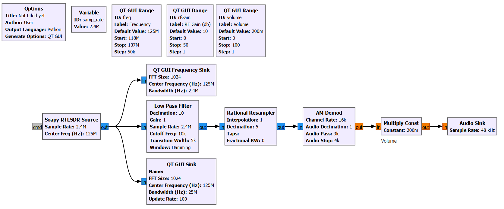

# Airband-Monitoring
# RTL-SDR Aviation Band AM Receiver

*flowgraph* GNU Radio Companion (GRC) yang dirancang khusus untuk memonitor dan mendemodulasi komunikasi suara AM pada pita frekuensi penerbangan (*Aviation Band*, 118 MHz - 137 MHz). Proyek ini dapat digunakan untuk mendengarkan saluran komunikasi penerbangan lokal, seperti *Approach Control* atau siaran ATIS (Automatic Terminal Information Service).

## 🚀 Fitur Utama
*   **Demodulasi AM Real-time:** Menerima sinyal dari RTL-SDR, memfilternya, dan melakukan demodulasi AM (*Amplitude Modulation*) secara langsung.
*   **Antarmuka Interaktif (QT GUI):** Dilengkapi dengan *slider* untuk menyesuaikan Frekuensi (118 MHz - 137 MHz), RF Gain (0 - 50 dB), dan Volume keluaran audio.
*   **Visualisasi Sinyal:** Menampilkan grafik spektrum frekuensi (FFT) dan *Waterfall Display* secara real-time untuk memudahkan identifikasi sinyal yang aktif.

## 🛠️ Prasyarat (Requirements)
Untuk menjalankan *flowgraph* ini, pastikan sistem Anda memiliki perangkat keras dan lunak berikut:
*   Perangkat Keras: RTL-SDR Dongle beserta antena yang mumpuni untuk VHF.
*   Perangkat Lunak:
    *   [GNU Radio](https://www.gnuradio.org/) (versi dengan dukungan QT GUI).
    *   `gr-osmosdr` atau modul `SoapySDR` untuk blok `Soapy RTLSDR Source`.

## ⚙️ Cara Penggunaan
1.  Kloning repositori ini ke komputer lokal Anda.
2.  Buka aplikasi **GNU Radio Companion**.
3.  Buka file `.grc` yang ada di dalam repositori ini.
4.  Klik tombol **Execute the flow graph** (ikon *play* berwarna hijau) di bilah alat atas.
5.  Gunakan antarmuka QT GUI yang muncul untuk menyesuaikan frekuensi ke saluran penerbangan yang ingin didengar.
